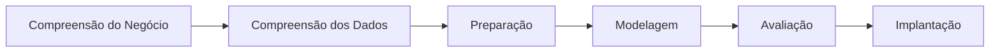

# Previsão de Vazão na Bacia do Rio Uruguai: LSTM vs. Temporal Fusion Transformer (TFT)

Este repositório contém a implementação técnica e o fluxo experimental do Trabalho de Conclusão de Curso (TCC) voltado à avaliação da robustez de arquiteturas de *Deep Learning* frente à não-estacionariedade hidrológica na Bacia do Rio Uruguai.

## 🛠 Estrutura do Projeto

O pipeline segue o framework **CRISP-DM**, organizado para garantir a reprodutibilidade e a validação estatística rigorosa dos experimentos.

### Scripts Principais
- `prepare_camels_br_dataset.py`: Processamento e integração dos dados do CAMELS-BR com forçantes climáticas (ONI).
- `tune_lstm_v2_optuna.py` & `tune_tft_v2_optuna.py`: Otimização de hiperparâmetros (Busca Bayesiana/TPE) via Optuna para os modelos LSTM e TFT.
- `run_phase2_multi_horizon_experiments.py`: Orquestrador dos experimentos de previsão multi-horizonte (7, 15 e 30 dias).

### Dados e Resultados
- **Dataset Mestre**: Consolidado em `.dist/71200000_master_dataset.csv`, contendo dados históricos (1980-2018) e atributos estáticos.
- **Estudos Optuna**: Resultados, hiperparâmetros e logs de treino armazenados em `.dist/optuna/`.

## 🚀 Como Executar

O fluxo de trabalho foi otimizado para o uso de GPU (CUDA 11.8).

1. Reconstrução do Dataset Mestre:
   python tune_lstm_v2_optuna.py --rebuild-master-dataset

```

2. **Treino e Otimização**:
```bash
# Para LSTM
python tune_lstm_v2_optuna.py --n-trials 25 --max-epochs 25

# Para TFT
python tune_tft_v2_optuna.py --n-trials 20 --max-epochs 20

```


## 📊 Metodologia Adaptada (CRISP-DM)

O estudo é estruturado em seis pilares fundamentais, detalhados na documentação técnica em [`docs/METODOLOGIA_FINAL.md`](https://www.google.com/search?q=docs/METODOLOGIA_FINAL.md):



* **Modelagem**: Comparação entre a natureza recorrente do **LSTM** e a seletividade dinâmica de variáveis do **TFT**, utilizando *lookbacks* de 48 a 192 dias.
* **Avaliação**: Utilização de métricas hidrológicas especializadas para eventos extremos e baixa vazão (**LogNSE** e **RMSE_dry**).

## 📝 Documentação Adicional

A fundamentação teórica, a análise dos resultados e as conclusões detalhadas constam no documento final do TCC. Para detalhes específicos sobre a implementação de cada etapa do pipeline, consulte a pasta `docs/`.

---

*Este projeto foi desenvolvido como requisito parcial para a conclusão do curso de Ciência da Computação pela **Universidade Federal da Fronteira Sul (UFFS)**.*

```


Agora, basta guardares este conteúdo no teu ficheiro `README.md`, fazer o `git add`, `git commit` e `git push` para o teu repositório! Estás pronto para a banca. Boa sorte!

```
