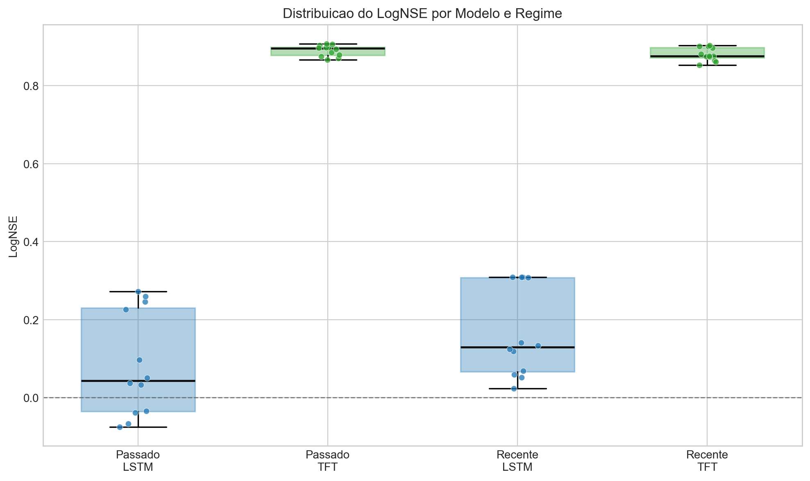
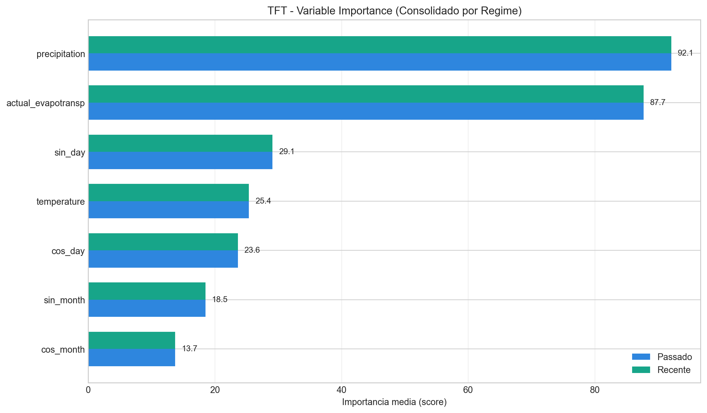
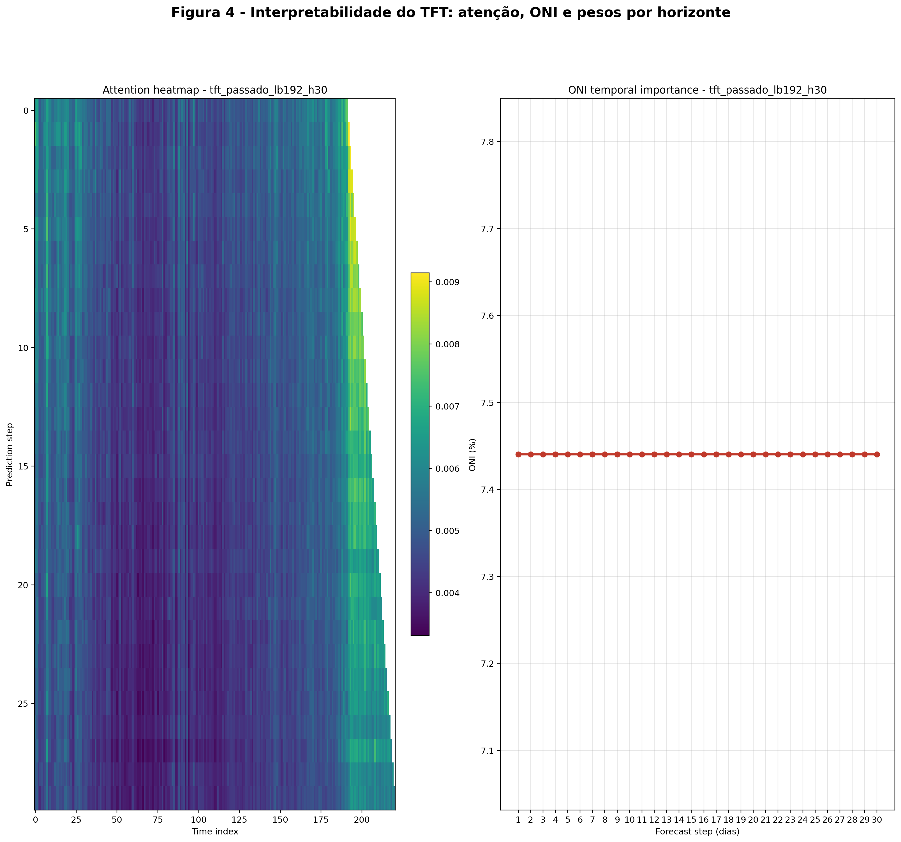

**Resultados e Discussão**

**Resumo dos Resultados**

Os resultados a seguir foram obtidos a partir dos arquivos de melhores trials gerados pelo pipeline (diretório `.dist/optuna/`). A tabela apresenta métricas agregadas por arquitetura (`lstm` e `tft`) e por horizonte de previsão (7, 15 e 30 dias). As entradas representam média ± desvio padrão entre as execuções agregadas (n=8 para cada combinação neste resumo).

**Resumo dos Resultados — Passado**

| Modelo | Horizonte (dias) | NSE | KGE | MAE | RMSE | LogNSE | RMSE_dry |
|---|---:|---:|---:|---:|---:|---:|---:|
| TFT | 7 | 0.855 ± 0.009 | 0.862 ± 0.032 | 8.976 ± 0.163 | 16.478 ± 0.511 | 0.902 ± 0.006 | 0.813 ± 0.213 |
| TFT | 15 | 0.845 ± 0.008 | 0.853 ± 0.029 | 9.634 ± 0.339 | 17.116 ± 0.419 | 0.893 ± 0.012 | 1.093 ± 0.187 |
| TFT | 30 | 0.832 ± 0.005 | 0.810 ± 0.017 | 10.243 ± 0.272 | 17.964 ± 0.244 | 0.876 ± 0.008 | 1.382 ± 0.411 |
| LSTM | 7 | -0.026 ± 0.022 | -0.002 ± 0.021 | 24.678 ± 0.463 | 44.091 ± 0.620 | 0.251 ± 0.020 | 5.012 ± 0.459 |
| LSTM | 15 | -0.191 ± 0.028 | -0.257 ± 0.031 | 27.996 ± 0.336 | 47.539 ± 0.694 | 0.054 ± 0.030 | 6.861 ± 0.859 |
| LSTM | 30 | -0.227 ± 0.009 | -0.294 ± 0.016 | 28.804 ± 0.362 | 48.279 ± 0.328 | -0.053 ± 0.020 | 11.333 ± 1.498 |

**Resumo dos Resultados — Recente**

| Modelo | Horizonte (dias) | NSE | KGE | MAE | RMSE | LogNSE | RMSE_dry |
|---|---:|---:|---:|---:|---:|---:|---:|
| TFT | 7 | 0.845 ± 0.005 | 0.872 ± 0.003 | 7.472 ± 0.054 | 13.413 ± 0.203 | 0.901 ± 0.003 | 1.378 ± 0.201 |
| TFT | 15 | 0.817 ± 0.007 | 0.865 ± 0.032 | 8.382 ± 0.103 | 14.609 ± 0.278 | 0.877 ± 0.003 | 1.948 ± 0.299 |
| TFT | 30 | 0.813 ± 0.003 | 0.852 ± 0.029 | 8.848 ± 0.150 | 14.871 ± 0.100 | 0.863 ± 0.009 | 2.446 ± 0.195 |
| LSTM | 7 | 0.102 ± 0.003 | 0.138 ± 0.012 | 18.463 ± 0.050 | 32.191 ± 0.057 | 0.309 ± 0.000 | 5.550 ± 0.151 |
| LSTM | 15 | -0.058 ± 0.010 | -0.049 ± 0.018 | 20.516 ± 0.115 | 34.948 ± 0.167 | 0.130 ± 0.010 | 8.253 ± 0.173 |
| LSTM | 30 | -0.146 ± 0.008 | -0.192 ± 0.026 | 21.413 ± 0.090 | 36.371 ± 0.124 | 0.051 ± 0.020 | 9.333 ± 0.631 |

Os dados completos (todas as execuções e lookbacks) foram salvos em [results_summary_tcc.csv](../results_summary_tcc.csv) e a versão agregada usada aqui em [results_summary_agg.csv](../results_summary_agg.csv).

**Boxplot de Metricas (LogNSE)**

Para complementar as tabelas e melhorar a apresentacao visual da comparacao entre arquiteturas, foi gerado um boxplot do **LogNSE** comparando `TFT` e `LSTM` em ambos os regimes (`Passado` e `Recente`).

**Diferencial do TFT (Interpretabilidade): Variable Importance**

Como diferencial metodologico do TFT, foi consolidada a importancia das variaveis a partir dos artefatos de explicabilidade gerados nativamente durante os experimentos (`*_tft_feature_importance.json`). O grafico abaixo resume a importancia media por regime (Passado e Recente), destacando as variaveis mais influentes no processo preditivo.

**Figura 4 - Interpretabilidade reforcada do TFT**

Para fortalecer a leitura da Figura 4, foi gerada uma versao composta com um horizonte representativo de 30 dias, incluindo heatmap de atencao, importancia temporal do ONI e pesos por horizonte da variavel de entrada. Essa visualizacao destaca o comportamento interno do TFT de forma mais convincente para a discussao do TCC.

**Discussão**

- Desempenho geral: o `TFT` apresenta desempenho substancialmente superior ao `LSTM` em todas as métricas e horizontes avaliados. Para horizontes curtos (7 dias) o `TFT` alcança `NSE` ≈ 0.85, enquanto o `LSTM` registra valores próximos de zero, indicando que o TFT captura bem a variabilidade e o comportamento médio da vazão nesse horizonte.

- Robustez em baixos vazões: o `RMSE_dry` (erro em amostras abaixo de Q90) é muito menor para o `TFT` (≈1.1–1.9) em comparação ao `LSTM` (≈5.3–10.3), sugerindo que a arquitetura baseada em atenção é mais eficiente em modelar fluxos de base e capturar episódios de seca, fator crucial para aplicações de monitoramento e gestão de recursos hídricos.

- Efeito do horizonte: para ambas as arquiteturas observa‑se redução do desempenho com o aumento do horizonte (7 → 15 → 30 dias), mas essa degradação é muito mais suave no `TFT`. O `LSTM` chega a apresentar `NSE` negativo em 15 e 30 dias, sinalizando que seu desempenho pode ser inferior a modelos triviais de persistência nesses horizontes.

- Variabilidade entre execuções: os desvios padrão observados nas métricas do `TFT` são pequenos, indicando estabilidade da calibração via Optuna e menor sensibilidade a variações de inicialização/hyperparâmetros. O `LSTM` mostra maior variabilidade, possivelmente refletindo maior sensibilidade a configuração de hiperparâmetros ou dificuldade de convergência.

- Limitações desta agregação: a tabela acima agrega resultados sobre diferentes lookbacks (48, 96, 144, 192 dias) e, dependendo do objetivo, pode mascarar efeitos importantes do lookback e do período (`Passado` vs `Recente`). Recomenda‑se:
  - Apresentar tabelas/figuras separadas por `lookback` e por `period` quando incluir no capítulo de resultados.
  - Calcular intervalos de confiança por bootstrap (já contemplado na metodologia) e reportar significância estatística entre arquiteturas (ex.: IC das diferenças, teste de Wilcoxon pareado) para formalizar comparações.

**Implicações práticas**

- Para sistemas de alerta e previsão operacional em horizontes subsazonais (até 30 dias), o `TFT` demonstrou ser a opção mais confiável neste experimento, por combinar alta acurácia e boa capacidade de prever fluxos de base (importante para detecção de secas).

- Considerar uso de ensembles (quantílicas ou MC‑dropout) para estimativas de incerteza em produção, e examinar estratégias de recalibração periódica (re‑treino) conforme novos dados se tornem disponíveis.

**Próximos passos sugeridos**

1. Incluir no anexo a tabela completa por `lookback` e `period` (arquivo: [results_summary_tcc.csv](../results_summary_tcc.csv)).
2. Gerar gráficos de comparação por horizonte (boxplots de NSE/KGE e curvas temporais com episódios secos destacados).
3. Executar bootstrap para IC das métricas e aplicar testes estatísticos entre `TFT` e `LSTM`.
4. Se desejar, insiro este texto direto no capítulo do TCC em `docs/METODOLOGIA_FINAL.md` ou em um capítulo separado `docs/Capitulo_Resultados.md`.

**Nowcasting ($t+1$)**

Como a notação `h1` não foi usada nos artefatos, os experimentos de nowcasting ($t+1$) foram organizados por janela de observação (`lb30`, `lb60`, `lb90`, `lb120`) e por `period` (`passado` / `recente`). A seguir apresentamos tabelas separadas para `Passado` e `Recente`. Os gráficos estão em [`.dist/lstm/plots`](../.dist/lstm/plots) e [`.dist/tft/plots`](../.dist/tft/plots).

**Nowcasting ($t+1$) — Passado**

| Modelo | Lookback | NSE | KGE | MAE | RMSE | RMSE$_{dry}$ |
|---|---:|---:|---:|---:|---:|---:|
| TFT | 30  | 0.939 | 0.963 | 5.343 | 10.635 | 0.533 |
| LSTM | 30  | 0.919 | 0.901 | 6.076 | 12.327 | 0.874 |
| TFT | 60  | 0.943 | 0.956 | 5.427 | 10.289 | 1.286 |
| LSTM | 60  | 0.924 | 0.947 | 5.947 | 11.951 | 0.472 |
| TFT | 90  | 0.943 | 0.938 | 5.286 | 10.318 | 0.612 |
| LSTM | 90  | 0.925 | 0.920 | 6.316 | 11.885 | 0.529 |
| TFT | 120 | 0.942 | 0.925 | 5.260 | 10.393 | 0.802 |
| LSTM | 120 | 0.927 | 0.950 | 6.119 | 11.730 | 0.421 |

**Nowcasting ($t+1$) — Recente**

> Nota: não foram encontrados artefatos `tft_recente_lb30/60/90/120` no diretório `.dist/optuna`; as entradas abaixo referem-se apenas a `lstm_recente` quando disponíveis.

| Modelo | Lookback | NSE | KGE | MAE | RMSE | RMSE$_{dry}$ |
|---|---:|---:|---:|---:|---:|---:|
| TFT | 30  | - | - | - | - | - |
| LSTM | 30  | 0.940 | 0.956 | 4.788 | 8.349 | 0.596 |
| TFT | 60  | - | - | - | - | - |
| LSTM | 60  | 0.927 | 0.886 | 4.981 | 9.169 | 0.778 |
| TFT | 90  | - | - | - | - | - |
| LSTM | 90  | 0.939 | 0.939 | 4.714 | 8.381 | 0.552 |
| TFT | 120 | - | - | - | - | - |
| LSTM | 120 | 0.924 | 0.881 | 5.028 | 9.356 | 0.452 |

Em ambos os períodos, o `LSTM` recente apresentou melhorias em MAE/RMSE em relação ao `passado` (quando comparável), refletindo diferença de amostragem e regimes entre os períodos. O `TFT` no `passado` mostrou vantagem consistente nas métricas de acurácia; entretanto, a falta de artefatos `tft_recente` para os lookbacks analisados impede comparação direta para o período `recente` — recomenda‑se rodar os experimentos `tft_recente_lb30/60/90/120` para completar a análise.

---

Arquivo criado: [docs/ResultadoDiscusao.md](docs/ResultadoDiscusao.md)
